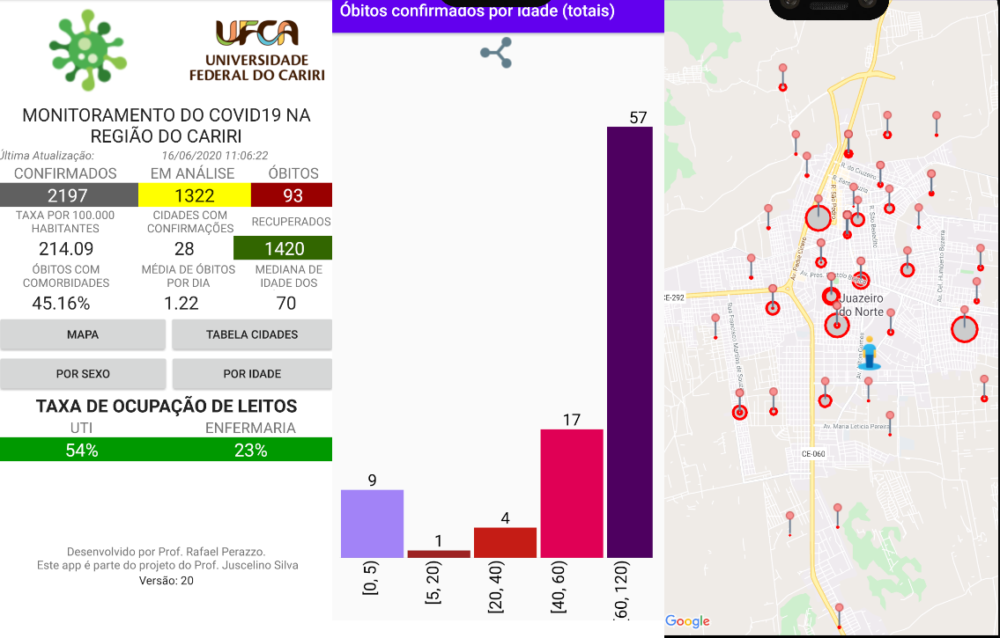
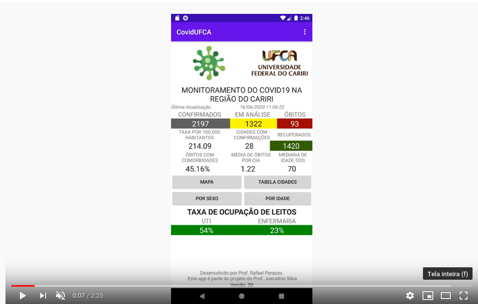

<html>
<head>
<meta name="viewport" content="width=device-width, initial-scale=1">
</head>
<body>

<h1>COVID19 - CARIRI</h1>

<h2>App de acompanhamento da evolução da covid19 na região do cariri cearense</h2>  
<h3>Desenvolvido por Rafael Perazzo Barbosa Mota</h3>
<h4>Parte do <a href="https://app.powerbi.com/view?r=eyJrIjoiYWYzMDRkZjctNzgzNy00NDY2LTk4YjMtNWRkMTIzYzA0MTFjIiwidCI6IjMyMTEyODk1LTEwNzItNDFiZS04MjVjLWExNzlhNmYyMzFiNiJ9">Painel de Monitoramento</a> do Prof. Juscelino Silva</h4>

 

Informações coletadas em: <a href='https://indicadores.integrasus.saude.ce.gov.br/indicadores/indicadores-coronavirus'>INTEGRASUS</a> 

Os dados são coletados diretamente da plataforma IntegraSUS (3 vezes ao dia) e processados para a região do cariri. As informações geradas englobam:

 <ul>
  <li>Quantidade de confirmações</li>
  <li>Quantidade de recuperados</li>
  <li>Quantidade de Óbitos</li>
  <li>Quantidade de casos em análise</li>
  <li>Quantidade de cidades com confirmação</li>
  <li>Média de óbitos por dia</li>
  <li>Perfil dos óbitos: Por idade e sexo e comorbidades;</li>
  <li>Gráficos dos totais de confirmações e óbitos: Por idade e sexo</li>
  <li>Mapa das cidades com confirmações</li>
  <li>Mapa dos bairros com confirmações</li>
</ul> 

<h3>Teste de todas as funcionalidades do app em Android 8.0</h3>

Os dados brutos podem ser coletados no <a href='https://github.com/rafaelperazzo/covid19'>projeto Covid19</a>.

<pre>   
    Copyright (C) &lt;2020&gt;  &lt;RAFAEL PERAZZO BARBOSA MOTA&gt;

    This program is free software: you can redistribute it and/or modify
    it under the terms of the GNU General Public License as published by
    the Free Software Foundation, either version 3 of the License, or
    (at your option) any later version.

    This program is distributed in the hope that it will be useful,
    but WITHOUT ANY WARRANTY; without even the implied warranty of
    MERCHANTABILITY or FITNESS FOR A PARTICULAR PURPOSE.  See the
    GNU General Public License for more details.

    You should have received a copy of the GNU General Public License
    along with this program.  If not, see &lt;https://www.gnu.org/licenses/&gt;.
</pre>

</body>

</html>